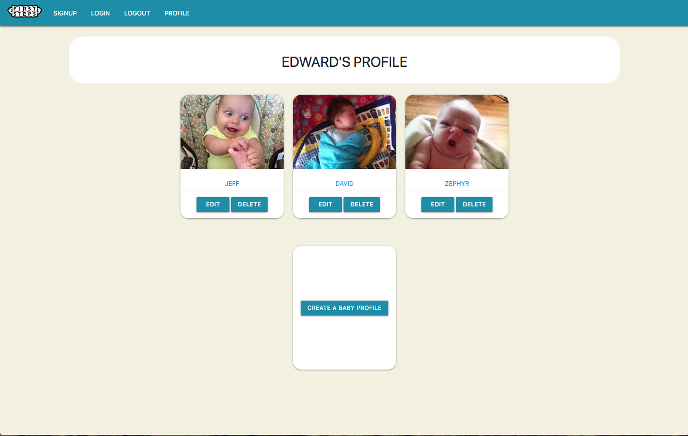
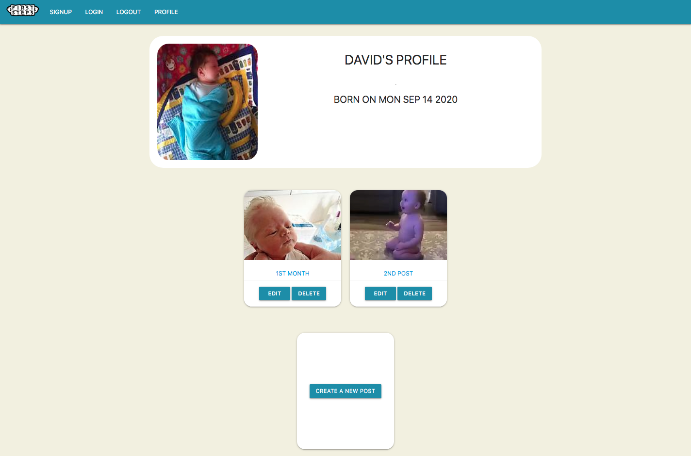
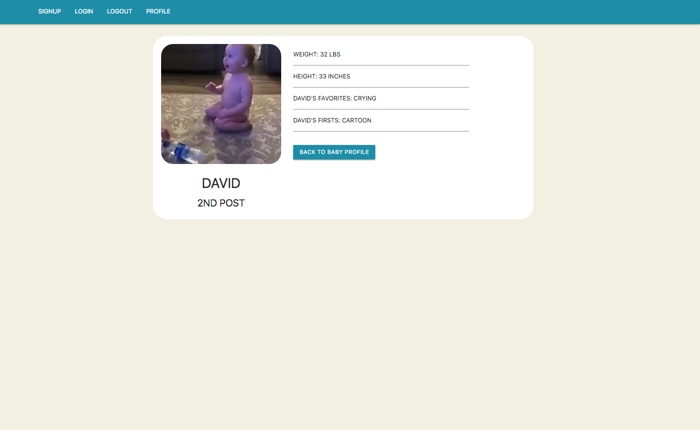

# FIRST STEPS
### A site to allow parents to track their babies' first experiences. Users log in, make profiles for their baby's, and then add images and record important milestones and events.


---
## Motivation
#### All of us had a book like this when we were children and we wanted to recreate the experience in a digital format in a way that is private, easy to use, and easy to share with friends and family far away.

---
## User Stories 

#### Users create an account and logs on, then creates profiles for their children. Once they go to their baby's profile, they can create posts with an image and text to record milestones. Users can edit or delete both baby profiles and individual posts.


#### * Entity Relational Diagram:

####  

#### * Site mockups:

####   

#### *  screenshot:

####   


---

## Technologies & Code Snippets
#### * Figma (for initial wireframing), HTML, CSS, JavaScript, Node.JS, Express, Sequelize, PostgresQL, EJS-layouts, Passport, Session, Flash, Method-Override
#### * Sample code:
#### 
```
router.put('/:name/:id', (req, res) => {
    db.baby.findOne({
        where: {
            name: req.params.name, 
            userId: req.user.id,
        }
    }).then((baby) => {
        db.post.findOne({
            where: {
                babyId: baby.id,
                id: req.params.id,
            }
        }).then((post) => {
            post.height= req.body.height;
            post.weight= req.body.weight;
            post.img= req.body.img;
            post.title= req.body.title;
            post.firsts= req.body.firsts;
            post.favorites= req.body.favorites;
            post.babyId= req.body.babyId;
            post.save().then((post) => {
                res.redirect('/profile/' + req.params.name);
            }).catch((error) =>{
                console.log(error);
            })                   
        }).catch((error) => {
                res.render('partials/alerts')
        })
    }).catch((error) => {
        res.render('partials/alerts')
    })
})    

```


#### 
```
require('dotenv').config();
const AWS = require ('aws-sdk')
const fs = require('fs')

// sets AWS version globally and assigns it to s3 variable
const BUCKET_NAME = "firststeps-assets"
const s3 = new AWS.S3({
  accessKeyId: ID,
  secretAccessKey: SECRET,
  accessKeyId:process.env.AWS_ID,
  secretAccessKey: process.env.AWS_SECRET_KEY
})

const uploadFile = (fileName)=>{
   // read content from the filenName
   const fileContent =fs.readFileSync(fileName);

   // setting up S3 upload parameters
   const params ={
      Bucket: BUCKET_NAME,
      Key: '01month.jpg',  //file name you want to save as in S3
      Body: fileContent
      // other parameters can be added, such as ContentType (file type) and ContentLength (file size)
   };
   // uploading files to the bucket
   s3.upload(params, function(err, data){
      if (err){
         throw err;
      }
      console.log(`File uploaded succsessfully. ${data.Location}`)
   });
};

uploadFile('01month.jpg')

```


---

### Site can be seen **[here.]**

---
## Credits
#### Our teammates, our General Assembly instructors, TAs, and class mates were very helpful, as well as numerous MDN and W3Schools articles for understanding CRUD. 

---

## Future development
#### Additions to come will be integrated image uploader capability, image carousel functionality so user can have iamge albums on posts, error logs to post for improved user experience. 

